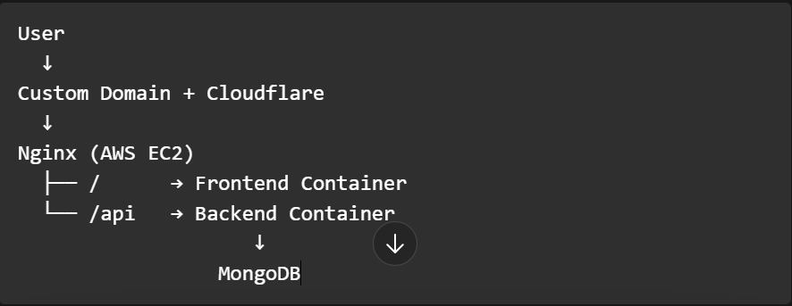
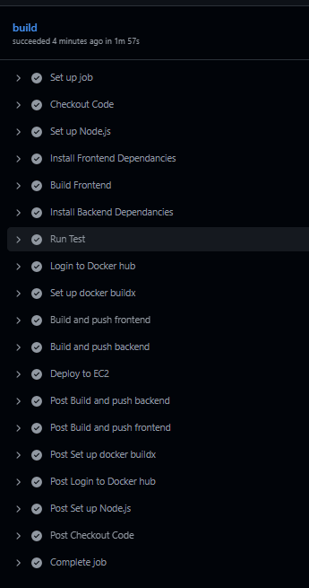

# devHub - Production-Ready MERN Application


## Overview

DevHub is a full-stack MERN application built with a production-style DevOps workflow. It demonstrates how to containerize, automate, test, and continuously deploy a modern web application using Docker, GitHub Actions, AWS EC2, and Nginx.

---

## 📋 Table of Contents

- [Tech Stack](#tech-stack)
- [Architecture](#architecture)
- [CI/CD Pipeline](#cicd-pipeline)
- [Features](#features)
- [Project Structure](#project-structure)
- [Getting Started](#getting-started)
- [Environment Variables](#environment-variables)
- [Docker Setup](#docker-setup)
- [GitHub Secrets](#github-secrets)
- [About the Developer](#about-the-developer)

---

## 🛠 Tech Stack

### Frontend
| Technology | Purpose |
|---|---|
| React + Vite | UI framework and build tool |
| Tailwind CSS | Styling |

### Backend
| Technology | Purpose |
|---|---|
| Node.js + Express | REST API server |
| MongoDB Atlas | Database |
| JWT | Authentication |


### DevOps & Infrastructure
| Technology | Purpose |
|---|---|
| Docker + Docker Compose | Containerization |
| GitHub Actions | CI/CD pipeline |
| Docker Hub | Container registry |
| AWS EC2 | Cloud hosting |
| Nginx | Reverse proxy |
| Cloudflare | DNS + Custom domain |

## 🏗 Architecture



The application runs two Docker containers on a single EC2 instance — a frontend container serving the React app and a backend container running the Express API. Nginx sits in front of both, routing `/api` traffic to the backend and everything else to the frontend. MongoDB is hosted externally on MongoDB Atlas.

---

## ⚙️ CI/CD Pipeline

This project went through two generations of CI/CD:

### Generation 1 — Jenkins (Local)
The original pipeline ran on a local Jenkins instance on my machine.
The `Jenkinsfile` is preserved in the repo for reference.

| Stage | What it does |
|---|---|
| Checkout | Pulls code from GitHub |
| Frontend Build | npm install + npm run build |
| Frontend SonarQube | Static code analysis |
| Backend Build | npm install + npm run build |
| Backend Tests | npm test |
| Backend SonarQube | Static code analysis |
| Docker Build & Push | Builds and pushes both images to Docker Hub |

> **Limitation:** Pipeline only ran when my machine was on.
> Every deployment required manual triggering from my local setup.

### Generation 2 — GitHub Actions (Current)
Migrated to GitHub Actions to solve the local dependency problem.
Pipeline now triggers automatically on every push to `main` from anywhere,
with no machine needing to be running.

**Key improvements over Jenkins:**
- Runs in the cloud — no dependency on local machine
- Triggers automatically on every push
- Secrets managed securely by GitHub
- Built-in npm and Docker layer caching
- Deploy step SSHs directly into EC2

**Pipeline Screenshot:**



> All 12 steps succeed in under 2 minutes thanks to GitHub Actions cache for both npm dependencies and Docker layers.

---

## ✨ Features

- JWT-based user authentication
- Frontend and backend separated into independent Docker services
- Fully automated CI/CD from code push to live deployment
- Docker layer caching for fast repeat builds
- Reverse proxy with Nginx routing `/api` to backend
- Custom domain with Cloudflare DNS
- Environment variable management via `.env` on EC2
- Health check endpoint at `/health` for backend monitoring
- Automatic cleanup of old Docker images on deploy (`docker image prune`)

---

## 📁 Project Structure

```
devHub_dockerized_app/
├── .github/
│   └── workflows/
│       └── ci-cd.yml          # GitHub Actions pipeline
├── devHub-web/                # React + Vite frontend
│   ├── Dockerfile
│   └── src/
├── DevHub/                    # Node.js + Express backend
│   ├── Dockerfile
│   └── src/
├── docker-compose.yml         # Production compose file (on EC2)
├── Jenkinsfile                # Legacy Jenkins pipeline
└── README.md
```

---

## 🚀 Getting Started

### Prerequisites
- Docker and Docker Compose installed
- Node.js 20+
- MongoDB Atlas connection string

### Run locally

```bash
git clone https://github.com/prajakta989/devHub_dockerized_app.git
cd devHub_dockerized_app

# Create .env file
cp .env.example .env
# Fill in your MONGODB_CONNECTION_STRING, JWT_SECRET, FRONTEND_URL

# Start all services
docker compose up -d
```

Frontend will be available at `http://localhost:3000`
Backend API at `http://localhost:5000`

---

## 🔐 Environment Variables

### Running locally
Create a `.env` file in the project root:

```env
MONGODB_CONNECTION_STRING=mongodb+srv://...
JWT_SECRET=your_jwt_secret
FRONTEND_URL=http://localhost:3000
```

### Production (EC2)
The `.env` file lives directly on the EC2 instance alongside `docker-compose.yml`.
It is **never committed to the repo**. Docker Compose reads it automatically via `env_file: .env` in the compose file.

/home/ubuntu/app/
├── docker-compose.yml
└── .env          ← lives here on the server, not in the repo

---

## 🐳 Docker Setup

### Build images locally

```bash
docker build -t prajakta989/devhubweb:latest ./devHub-web
docker build -t prajakta989/devhub:latest ./DevHub
```

### Production `docker-compose.yml` (on EC2)

```yaml
services:
  frontend:
    image: prajakta989/devhubweb:latest
    ports:
      - "3000:80"
    restart: always

  backend:
    image: prajakta989/devhub:latest
    ports:
      - "5000:3000"
    env_file:
      - .env
    depends_on:
      - mongo
    restart: always
```

> Note: Images are pulled from Docker Hub — never built on EC2 directly.

---

## 🔑 GitHub Secrets

The following secrets are required in **Settings → Secrets → Actions**:

| Secret | Description |
|---|---|
| `DOCKER_USERNAME` | Docker Hub username |
| `DOCKER_PASSWORD` | Docker Hub access token |
| `EC2_HOST` | EC2 public IP or DNS |
| `EC2_USER` | SSH username (e.g. `ubuntu`) |
| `EC2_SSH_KEY` | Contents of your `.pem` file |

---

## 👩‍💻 About the Developer

**Prajakta Naik Mule** — Frontend Developer transitioning into DevOps & Cloud

I spent nearly 2 years building production React applications as a frontend developer, which gave me a strong foundation in how real-world web apps are structured and shipped. I'm now actively learning DevOps and cloud infrastructure — applying that experience to understand the full lifecycle of an application, from writing the code to deploying and monitoring it in production.

This project is a hands-on demonstration of that transition: taking a MERN app I understand deeply as a developer and building a complete CI/CD pipeline around it using GitHub Actions, Docker, and AWS EC2.

**Skills:**
- Frontend: React, Vite, Tailwind CSS, JavaScript
- Backend: Node.js, Express, MongoDB, REST APIs
- DevOps (learning): Docker, Docker Compose, Jenkins, GitHub Actions, AWS EC2, Nginx, Linux

**Currently open to:** Frontend, Full-Stack, DevOps, and Cloud roles

[](https://github.com/prajakta989)

---

*Built and deployed with a fully automated CI/CD pipeline — every commit to `main` goes live automatically.*
